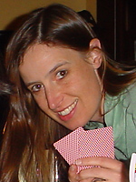
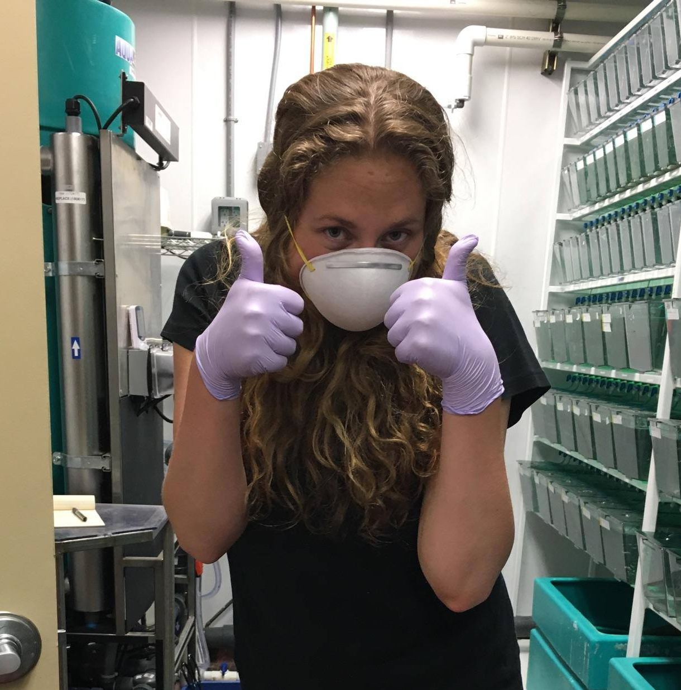
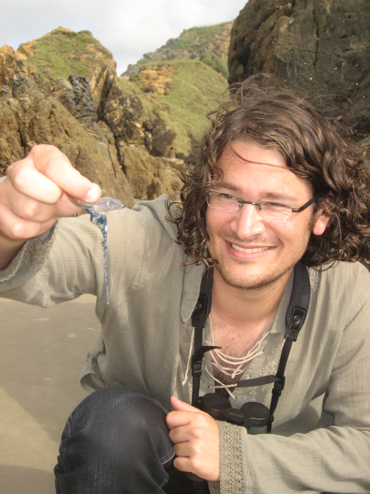
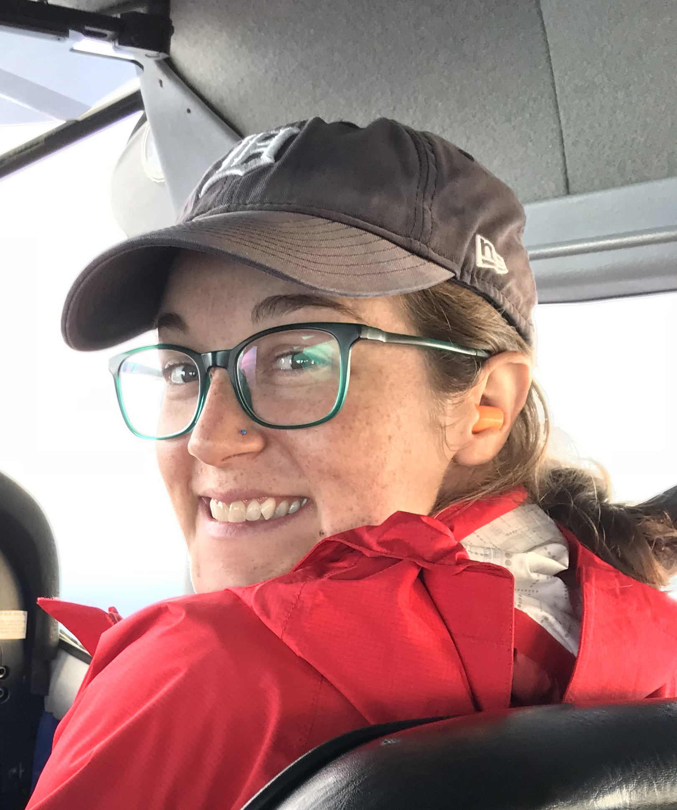
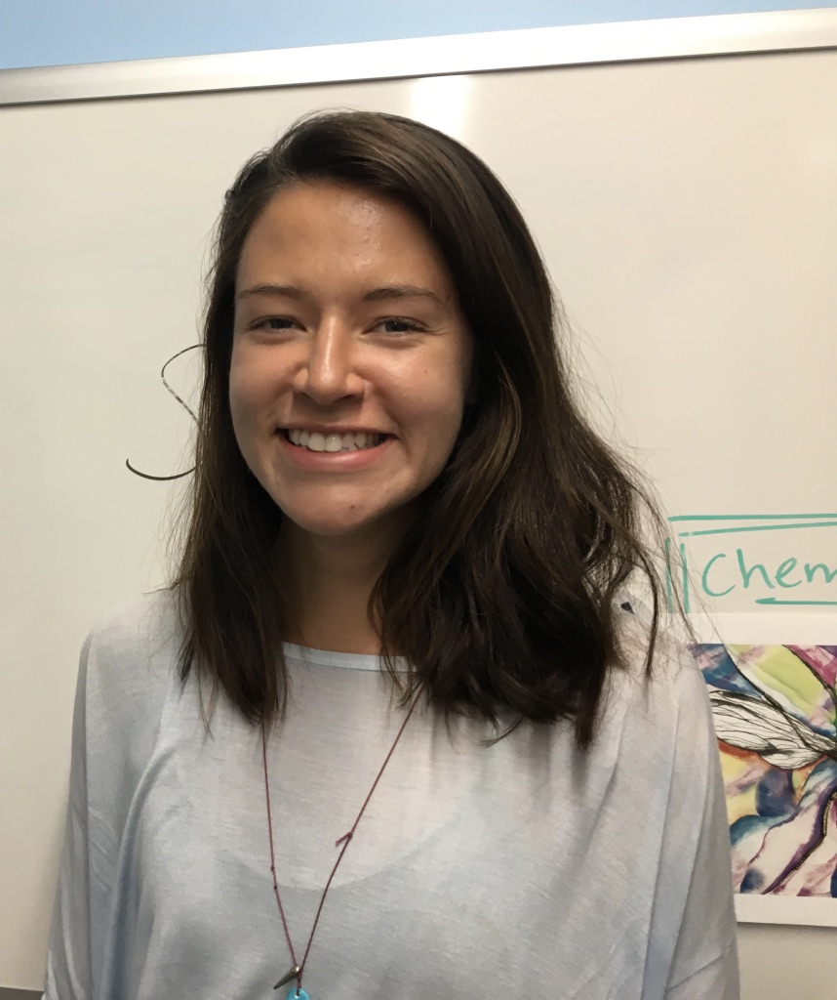
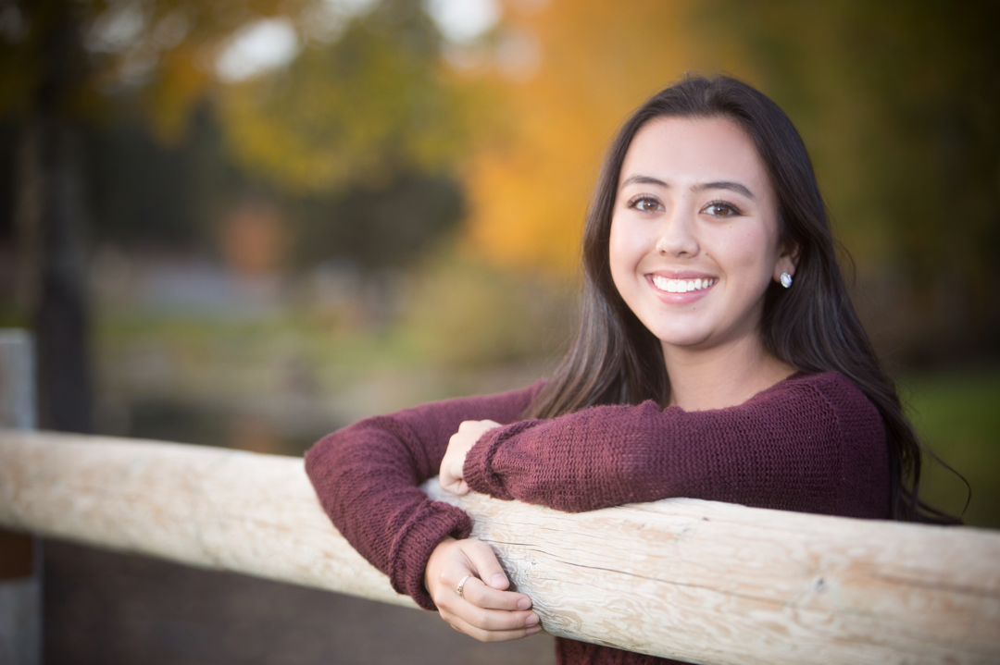

## Bill Cresko, Principal Investigator

{:height="200px" width="200px"}
>I am a geneticist who specializes in quantitative evolutionary genomics. Our laboratory studies the developmental genetic and genomic basis of evolution in natural populations using a variety of laboratory and field approaches tightly connected to innovation in genomics and quantitative biology.
[Bill Cresko Bio](../_pages/cresko.md)

## Present Members

**Susie Bassham, Senior Research Associate**

{:height="200px" width="200px"}

> What are the developmental and genetic bases of evolution in natural populations?
Using a variety of molecular genetic tools, I try to uncover genome-scale patterns
that underlie phenotypic variation in wild populations of fish, and to direct this
knowledge to the study of developmental pathways that contribute to novel or modified
morphologies.
[Susie Bassham Bio](../_pages/cresko.md)

____________

**Mark Currey, Senior Research Assistant**

{:height="200px" width="200px"}

> I’m interested in understanding the vast variety of life. How is morphological
variation, seen in populations of the same species, partitioned among different
environments and what are the genetic and genomic factors associated with this
partitioning? To get at this I’m investigating the distribution of populations of
threespine stickleback in Oregon, looking for patterns of association between
phenotype and environment, and ultimately querying the genomes of these populations
to associate patterns we see at the phenotypic level with patterns at the genetic
and genomic level.  
[Mark Currey Bio](../_pages/cresko.md)

____________

**Emily Beck, Research Associate**

{:height="200px" width="200px"}

>  I am a geneticist with a long-standing interest in how genetic interactions 
influence evolutionary dynamics and how those dynamics impact disease states. My 
doctoral thesis work primarily focused on mitochondrial and nuclear genome interactions 
as they relate to speciation in Drosophila. As a postdoctoral research fellow, I significantly 
extended my experiences to focus on host-microbe interactions and their broader influences on 
progression of disease states in outbred threespine stickleback fish (Gasterosteus aculeatus).

____________

**Clay Small, Research Associate**

{:height="200px" width="200px"}

> The characterization of transcriptomic phenotypes using RNA-seq is a promising approach for understanding
how genomes serve as conduits for the origin, maintenance and modification of ecologically relevant traits.
To this end, I study the male pregnancy transcriptome in syngnathid fishes, and how genotype-by-environment
interactions affect the microbe-associated gastrointestinal transcriptome of threespine stickleback.

____________

**Martin Stervander, Postdoctoral Scholar**

{:height="200px" width="200px"}

> I am broadly interested in evolutionary biology and ecology, with a passion
for birds. In my PhD project, I used traditional and “next generation” DNA
sequencing to study speciation processes in several groups of birds, and
focused on natural selection on bill morphology. In my postdoc project I keep
my eye on the feeding apparatus, but go below the surface to study the
development and evolution of the highly derived craniofacial morphology of
pipefishes and seahorses.

____________

**Hannah Tavalire, Postdoctoral Scholar**

{:height="200px" width="200px"}

> My broad research interests center around determining the genetic and environmental 
basis for phenotypic traits using genomic and classical quantitative genetics approaches. 
Specifically, I am interested in how the microbiome is shaped by host and environmental 
factors and how host-microbe interactions affect host health and fitness in human and 
fish populations.  

____________

**Sophia Frantz, Ph.D. Student**

{:height="200px" width="200px"}

> Sophia needs to say something about herself

____________

**Starla Chambrose, Undergraduate Researcher; Clark Honors College**

{:height="200px" width="200px"}

> My broad research interests include studying the genetic underpinnings of morphological 
variation and the evolution of developmental pathways. To this end, I am currently 
investigating the role of the evenskipped gene eve1 in threespine stickleback, which 
appears to have a role in tooth formation and body axis determination in other teleost 
models.

____________

**Emily Niebergall, Undergraduate Researcher; Clark Honors College**

{:height="200px" width="200px"}

> I am interested in studying the onset of adaptive immunity in threespine stickleback fish. By pinpointing 
the onset of the adaptive immune system, threespine stickleback can be advanced as models for immunogenetics 
studies. I am also interested in studying the impact of microbial influence on the development of the adaptive 
immune system.

____________

**Nia Harper, Undergraduate Researchere**

{:height="200px" width="200px"}

> 

____________

**Jade Kast, Undergraduate Researcher**

{:height="200px" width="200px"}

> 

____________

## Past Members

## Postdocs

**Kat Milligan-Myhre**

> Assistant Professor at University of Alaska, Anchorage, https://drkatlab.wordpress.com

____________

**Kristin Sikkink**

____________

**Kristin Alligood**

____________

**Thom Nelson**
xxxx

____________

**Allison Fuiten**
xxxx
