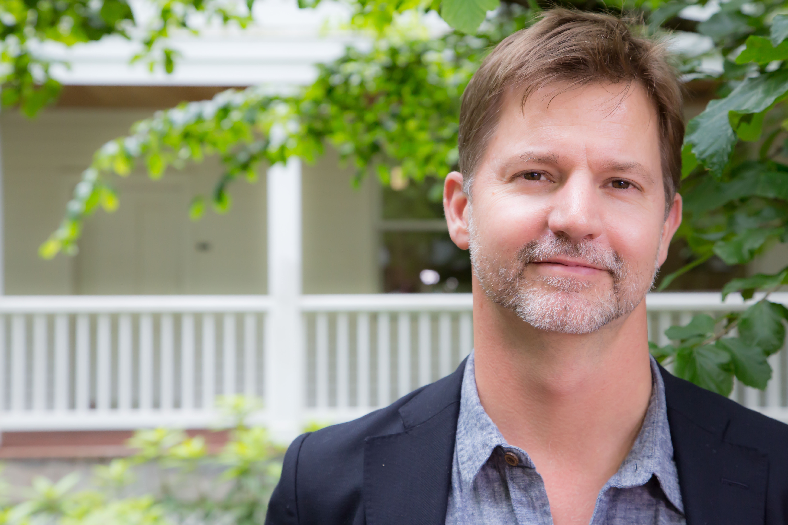
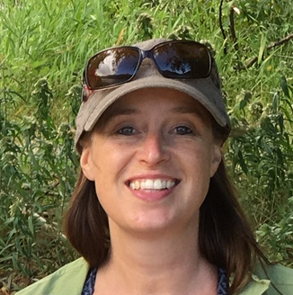
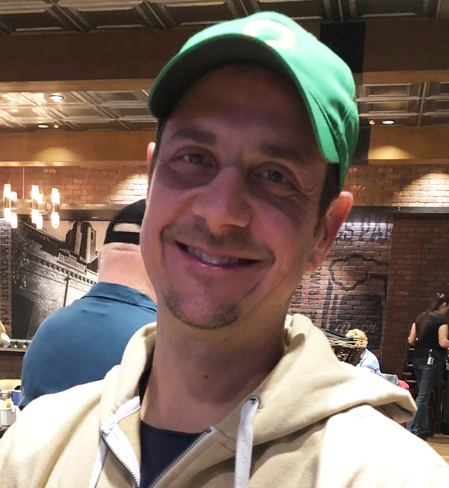
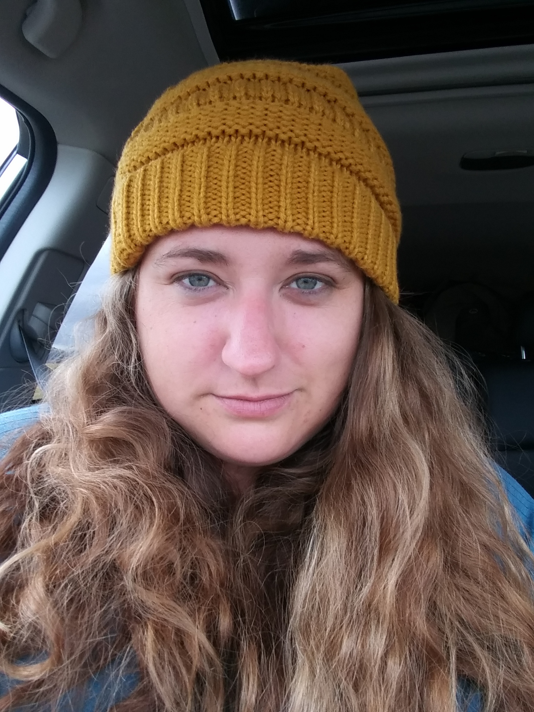
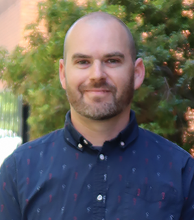
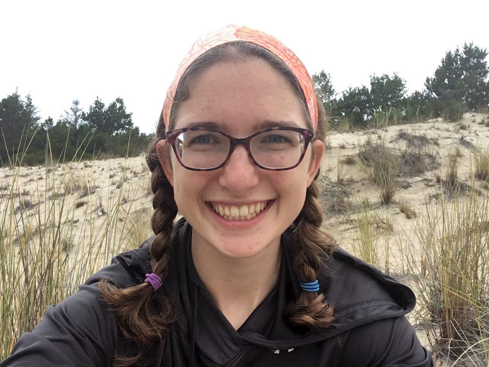
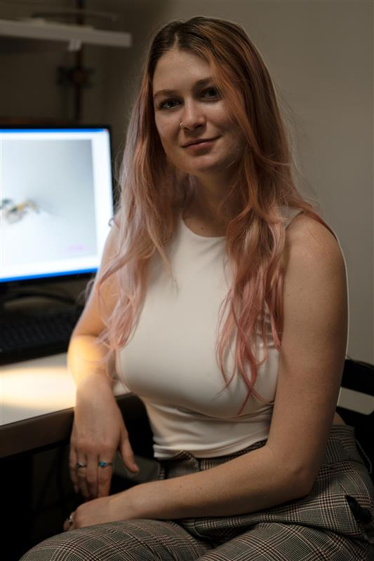
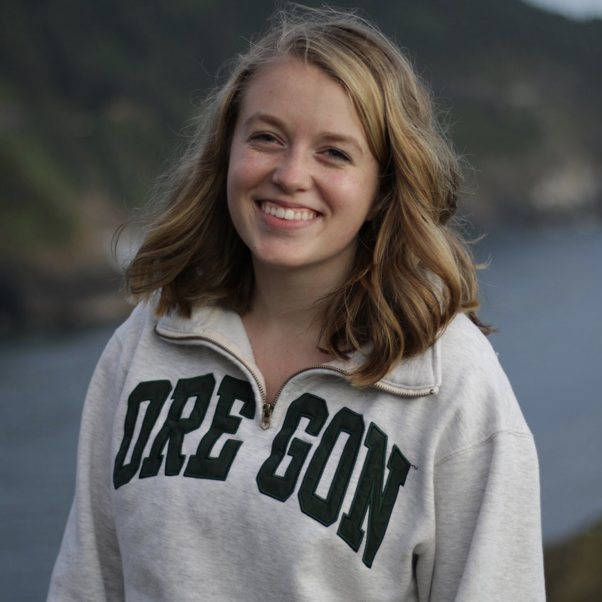
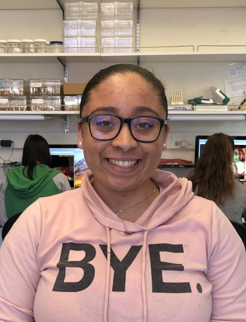
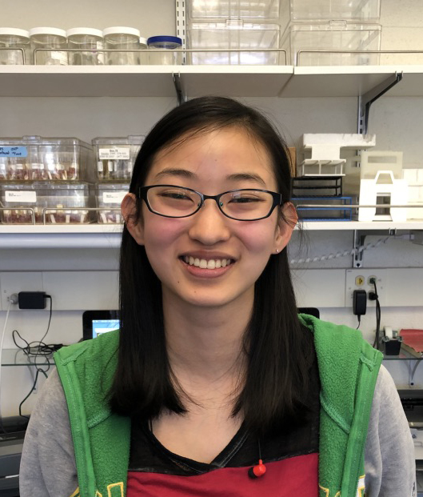

# Present Members

## Bill Cresko, Principal Investigator

{:height="200px" width="200px"}
>I am a geneticist who specializes in quantitative evolutionary genomics. Our laboratory studies the developmental genetic and genomic basis of evolution in natural populations using a variety of laboratory and field approaches tightly connected to innovation in genomics and quantitative biology.
[Bill Cresko Bio](../_pages/cresko.md)

**Susie Bassham, Senior Research Associate**

{:height="200px" width="200px"}

> What are the developmental and genetic bases of evolution in natural populations?
Using a variety of molecular genetic tools, I try to uncover genome-scale patterns
that underlie phenotypic variation in wild populations of fish, and to direct this
knowledge to the study of developmental pathways that contribute to novel or modified morphologies.
[Susie Bassham Bio](../_pages/bassham.md)

____________

**Mark Currey, Senior Research Assistant**

{:height="200px" width="200px"}

> I’m interested in understanding the vast variety of life. How is morphological
variation, seen in populations of the same species, partitioned among different
environments and what are the genetic and genomic factors associated with this
partitioning? To get at this I’m investigating the distribution of populations of
threespine stickleback in Oregon, looking for patterns of association between
phenotype and environment, and ultimately querying the genomes of these populations
to associate patterns we see at the phenotypic level with patterns at the genetic
and genomic level.  
[Mark Currey Bio](../_pages/currey.md)

____________

**Emily Beck, Research Associate**

{:height="200px" width="200px"}

>  I am a geneticist with a long-standing interest in how genetic interactions 
influence evolutionary dynamics and how those dynamics impact disease states. My 
doctoral thesis work primarily focused on mitochondrial and nuclear genome interactions 
as they relate to speciation in Drosophila. As a postdoctoral research fellow, I significantly 
extended my experiences to focus on host-microbe interactions and their broader influences on 
progression of disease states in outbred threespine stickleback fish (Gasterosteus aculeatus).

____________

**Clay Small, Research Associate**

{:height="200px" width="200px"}

> The characterization of transcriptomic phenotypes using RNA-seq is a promising approach for understanding
how genomes serve as conduits for the origin, maintenance and modification of ecologically relevant traits.
To this end, I study the male pregnancy transcriptome in syngnathid fishes, and how genotype-by-environment
interactions affect the microbe-associated gastrointestinal transcriptome of threespine stickleback.

____________

**Hope Healey, Ph.D. Student**

{:height="200px" width="200px"}

> I am interested in the developmental genetic basis of novel teleost morphologies. In particular, 
I am fascinated by syngnathids due to their highly modified traits and alterations in key developmental 
gene families. I hope to understand how gene regulatory networks have been modified in syngnathids to 
create unique morphologies such as their derived craniofacial features.
[Hope Healey Bio](../_pages/healey.md)

____________

**Shannon Snyder, Ph.D. Student**

{:height="200px" width="200px"}

> My dissertation work is focused on uncovering the molecular mechanisms governing within and between generational phenotypic plasticity. By capitalizing on the invasive water flea, Daphnia lumholtzi’s, dramatic morphological response to predation, I am working to disentangle the molecular and epigenetic mechanisms underlying this plastic response and its persistence over generational time.

____________

# Past Members

## Postdocs

**Kat Milligan-Myhre**

> Assistant Professor at University of Alaska, Anchorage - [Website](https://drkatlab.wordpress.com/author/napaaqtuk/)

____________

**Ann Petersen**

> Assistant Professor at Oregon State University, Cascades - [Website](http://blogs.oregonstate.edu/sticklebackproject/)

____________

**Julian Catchen**

> Assistant Professor at University of Illinois, Urbana-Champaign - [Website](http://catchenlab.life.illinois.edu)

____________

**Paul Hohenlohe**

> Assistant Professor at University of Idaho - [Website](http://hohenlohelab.github.io)

____________

**Martin Stervander, Postdoctoral Scholar**

____________

**Hannah Tavalire, Postdoctoral Scholar**

## Graduate Students

**Kristin Sikkink**

> Postdoctoral Research Associate, University of Minnesota

____________

**Kristin Alligood**

> Research Associate Oregon Department of Fish and Wildlife

____________

**Thom Nelson**

> Postdoctoral Research Associate, University of Montana

____________

**Sophia Frantz, Ph.D. Student**

____________

**Allison Fuiten**

> Postdoctoral Research Associate, Oregon Health and Science University

____________

**Emily Lescak**

> Research Associate, Alaska Department of Fish and Game

____________

**Andrew Nishida**

> Computational Scientist, Altius Institute for Biomedical Sciences

____________

**Alida Gerristen**

> Postdoctoral Research Associate, National Renewable Energy Laboratory

____________

**Conor O'Brien**

> Senior Consultant at Deloitte Consulting

____________

**Quick Yeates-Burghart**

> 

____________

**Robert Steury**

> Talent at Steury Stonework and Design

## Research Assistants

**Kate Ituarte**

> Resident, Harvard University

____________

**Nicholas Stiffler**

> Software Developer, University of Oregon

____________

**Jason Sydes**

> Research Assistant, Postlethwait Lab - University of Oregon

____________

**Roberta Torunsky**

> Founder of Healing Alma

____________

**Nicole Nishimura**

> Manager at Sessrumnir LLC

____________

**Joseph Dunham**

____________

**Frances Sung**

> Research Associate, UCLA

## Undergraduate Researchers

**Emily Niebergall, Undergraduate Researcher; Clark Honors College**

{:height="200px" width="200px"}

____________

**Nia Harper, Undergraduate Researcher**

{:height="200px" width="200px"}

____________

**Jade Kast, Undergraduate Researcher**

{:height="200px" width="200px"}

____________

**Jack Peplinksi**

____________

**John Crandall**

____________

**Sophie Sichel**

____________

**Erik Parker**

____________

**Shira Mali**

____________

**John Letaw**

____________

**Maya Rommwatt**

____________

**Taylor Wilson**

____________

**Steve Perry**

____________

**Ryan Bourdo**

____________

**James Bolle**

____________

**Larissa Unruh**

____________

**Jenna Wood**

____________

**Emily Armstrong Buck**

____________

**Jessica Ava**

____________

**Emma Kostin-Conley**

____________

**Caroline Emui-Wei**

____________

**Clayton Merz**

____________

**Shannon Cannon**

____________

**Jennea Wood**

___________________________________________

## Sabbatical Visitors

____________

**Beren Robinson** 

> [Website](https://www.uoguelph.ca/ib/robinson)

____________

**Bob Kaplan**

> [Website](https://www.reed.edu/biology/professors/rkaplan/)
