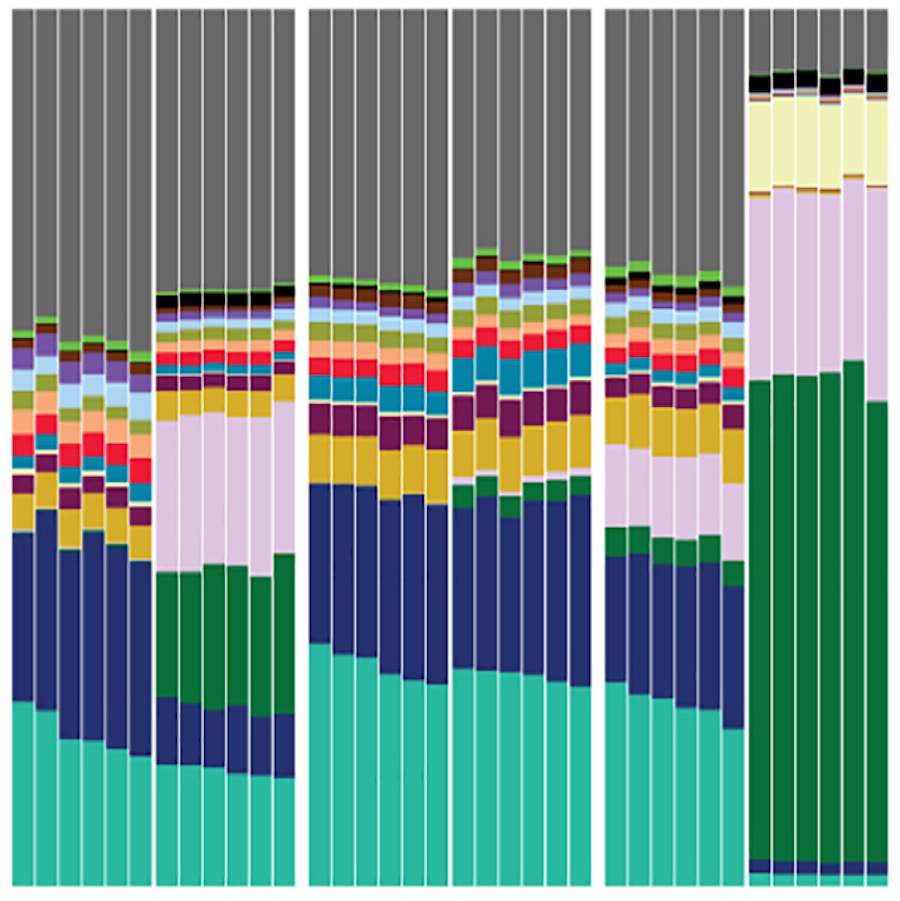

{:height="200px" width="200px"}
[**Population genomics and genome evolution**](../_pages/research_genome.md)

{:height="200px" width="200px"}
[**Evolution of Development**](../_pages/research_evo_devo.md)

{:height="200px" width="200px"}
[**Host-microbe ecology and evolution**](../_pages/research_host-microbe_interactions.md)
